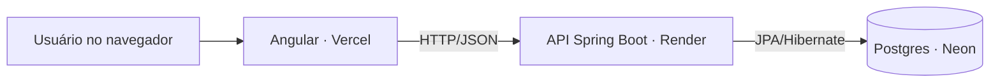

# Sistema de Gerenciamento de Usuários — Frontend


Aplicação Angular para cadastro, listagem, edição e exclusão de usuários, consumindo uma API REST própria em Spring Boot.

**🔗 Demo ao vivo:** https://projeto-angular-jade.vercel.app

> Repositório do backend: [gerenciamento-backend](https://github.com/luis-ferreira-jr/gerenciamento-backend)

## Visão geral

| | |
|---|---|
| **Frontend** | Angular 20 (standalone components), Angular Material, RxJS |
| **Backend** | [Spring Boot + Postgres](https://github.com/luis-ferreira-jr/gerenciamento-backend) |
| **Hospedagem** | Vercel (frontend) · Render (API) · Neon (banco Postgres) |



## Funcionalidades

- ✅ Cadastro de usuário com validação de nome, email, CPF (dígito verificador real) e senha
- ✅ Listagem de usuários com busca por nome/email
- ✅ Edição de usuário (nome, email, CPF e, opcionalmente, senha) via modal
- ✅ Exclusão de usuário com confirmação
- ✅ Feedback de carregamento e erros de validação vindos da API

## Rodando localmente

Pré-requisitos: Node.js 20+ e o [backend](https://github.com/luis-ferreira-jr/gerenciamento-backend) rodando em `http://localhost:8080` (veja o README dele para subir com H2, sem precisar de banco externo).

```bash
npm install
npm start
```

Acesse `http://localhost:4200`. Em desenvolvimento, a API é apontada em `src/environments/environment.ts`; em produção, em `environment.prod.ts` (trocado automaticamente no build via `angular.json`).

## Build de produção

```bash
npm run build
```

Gera os artefatos em `dist/projeto-angular/browser`. O deploy no Vercel usa o `vercel.json` deste repositório (build command + rewrite de rotas para o Angular Router funcionar em produção).

## Estrutura

```
src/app/
├── components/
│   ├── home/          # página inicial
│   ├── register/      # formulário de cadastro
│   └── list-user/      # listagem, edição e exclusão
├── models/             # interfaces (Usuario, UsuarioResponse, UsuarioUpdate)
├── services/           # UsuarioService (HTTP client)
└── validators/          # validadores customizados (CPF, senha)
```

## Autor

**Luis Carlos** — [github.com/luis-ferreira-jr](https://github.com/luis-ferreira-jr)
